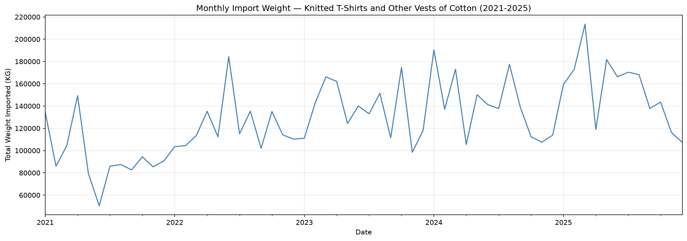
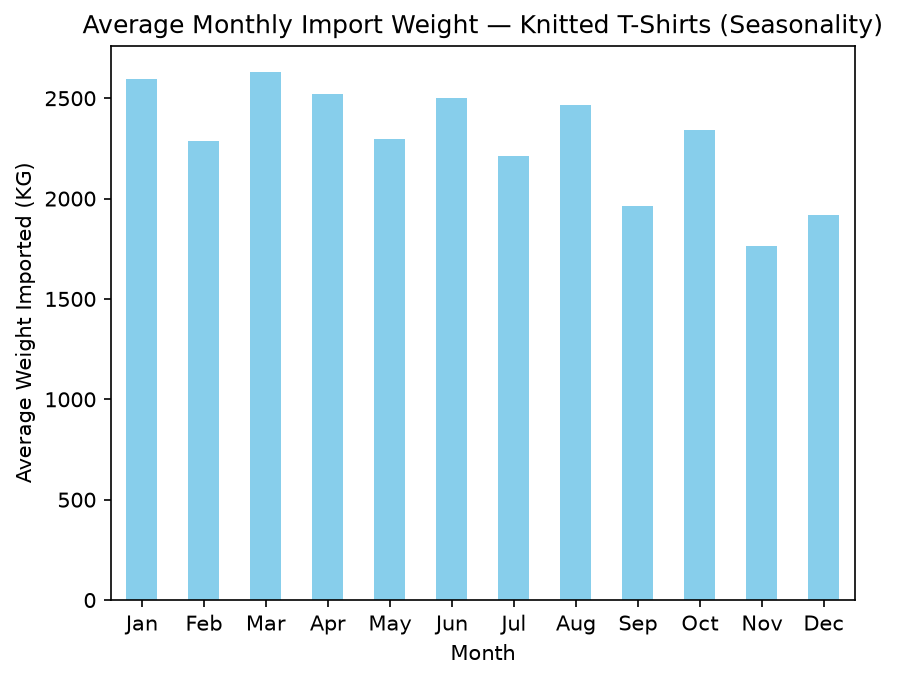
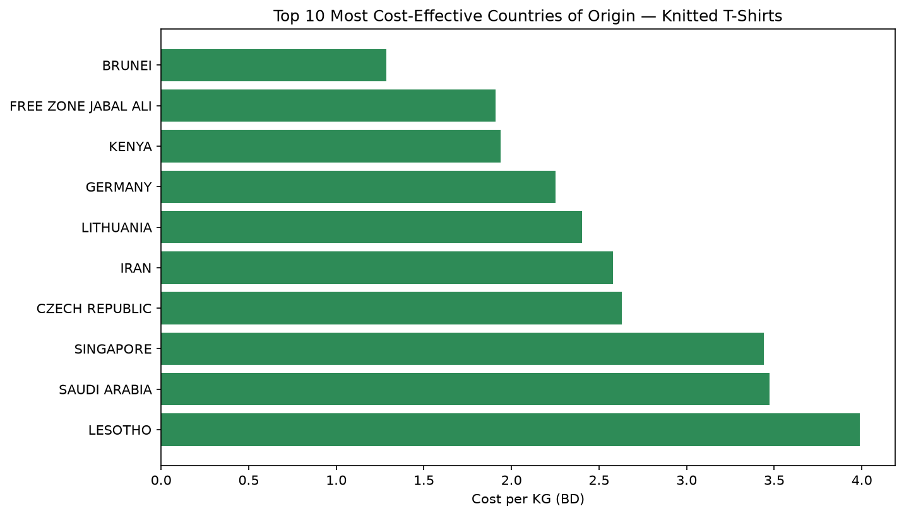

# Project_2
Project2

## Problem Statement

A local business currently relies on costly third-party distributors to source Knitted 
T-Shirts and Other Vests of Cotton, inflating operational costs and limiting margins. This 
project analyzes five years of Bahrain import data (2021-2025) to uncover volume trends, 
seasonal patterns, and the most cost-effective countries of origin to support a direct-import 
strategy.

## Executive Summary

This project analyzes Bahrain's foreign trade data from the Bahrain Open Data Portal, including monthly transaction-level import records from 2021-2025. The dataset of almost 1.6 million transactions was cleaned by integrating five yearly data files and addressing issues such as inconsistent column formats, missing values, inaccurate data types, and non-standardized date formats. The investigation focused on Knitted T-Shirts and Other Cotton Vests, which had the largest transaction count and the most supplier nations (133), making it the best contender for cost-effective sourcing.

Import volume for this commodity has progressively increased beginning 2021, reaching a peak of over 200,000 KG by 2024-2025. 
The data showed significant seasonal fluctuations, with certain months regularly importing more than others, regardless of the year. The cost per kilogram varies greatly by nation of origin, with the most expensive dependable supply charging roughly three times more than the cheapest. Brunei, Free Zone Jabal Ali, and Kenya were the most cost-effective countries of origin for suppliers with significant transaction volume.

The recommendation is to target Brunei and Kenya as direct-import partners to lower per-unit purchasing costs and schedule larger orders ahead of seasonal demand peaks. Diversifying over two to three cost-effective countries is recommended to reduce reliance on one supplier.

# File Directory

| Folder / File | Description |
|---------------|-------------|
| Data/ | Contains all raw and cleaned datasets. |
| Data/bahrain_import_2021.csv | Raw import data for 2021. |
| Data/bahrain_import_2022.csv | Raw import data for 2022. |
| Data/bahrain_import_2023.csv | Raw import data for 2023. |
| Data/bahrain_import_2024.csv | Raw import data for 2024. |
| Data/bahrain_import_2025.csv | Raw import data for 2025. |
| Data/bahrain_import_cleaned.csv | Final cleaned dataset used for analysis. |
| Data/bahrain_import_knitted_tshirts.csv | Filtered dataset for the selected commodity. |
| EDA/EDA_Report_Template.ipynb | Exploratory Data Analysis notebook. |
| Presentation/ | Presentation materials. |
| README.md | Project documentation. |

# Data & Data Dictionary

## Dataset Source

The dataset was obtained from the [Bahrain Open Data Portal](https://www.data.gov.bh/explore/?disjunctive.theme&sort=modified), 
with Bahrain Customs Affairs as the primary source, and contains Bahrain's import records 
from 2021 to 2025.

| Column | Data Type | Description |
|--------|-----------|-------------|
| Year | int64 | Import year |
| Month | string | Import month |
| Commodity No | string | Commodity identification code |
| Commodity | string | Commodity name |
| UN code | string | United Nations commodity code |
| Country Name | string | Exporting country |
| Import Value (BD) | float64 | Import value in Bahraini Dinar |
| Import Value (USA $) | float64 | Import value in US Dollars |
| Import Weight (KG) | float64 | Import weight in kilograms |
| Import Quantity | float64 | Quantity of imported goods |
| UM | string | Unit of measurement |
| Import_Date | datetime64 | Engineered date column created from Year and Month |

---

# Conclusions & Recommendations

## Conclusions

- Import volume for Knitted T-Shirts has grown consistently since 2021, from roughly 
  80,000-140,000 KG per month to peaks over 200,000 KG by 2024-2025.
- Cost per kilogram varies by more than 3x between the cheapest and most expensive reliable 
  suppliers, making sourcing country a major cost lever.
- Brunei, Free Zone Jabal Ali, and Kenya are the most cost-effective countries of origin 
  among suppliers with meaningful transaction volume.

## Recommendations

- Prioritize Brunei and Kenya as primary direct-import partners to reduce per-unit cost.
- Time larger orders ahead of seasonal demand peaks identified in the analysis.
- Diversify across 2-3 cost-effective countries to reduce single-supplier dependency risk.
- Re-evaluate supplier cost rankings periodically, as trade conditions shift over time.

---

# Areas for Further Research

- Cost-per-KG does not include shipping, customs, or lead-time differences, which affect 
  the true landed cost.
- Incorporating minimum order quantities or shipping cost data would refine the sourcing 
  recommendation further.
- Comparing this commodity against related textile categories could validate whether 
  trends are commodity-specific or category-wide.
- Studying supplier reliability and delivery consistency, not just price.

---

# Sources

- [Bahrain Open Data Portal](https://www.data.gov.bh/explore/?disjunctive.theme&sort=modified) — 
  source of the 2021–2025 import datasets used in this project
  - [Import 2021](https://www.data.gov.bh/explore/dataset/05-import-2021/table/?sort=-n)
- [Import 2022](https://www.data.gov.bh/explore/dataset/04-import-2022/table/)
- [Import 2023](https://www.data.gov.bh/explore/dataset/01-import-non-oil-classified-by-commodity-and-country-for-2023/table/?disjunctive.month&disjunctive.country_name)
- [Import 2024](https://www.data.gov.bh/explore/dataset/import-2024/table/?disjunctive.month&sort=-n)
- [Import 2025](https://www.data.gov.bh/explore/dataset/import-1-2025/table/?disjunctive.month&sort=year)
- [HS Code Reference](https://www.foreign-trade.com/importers.htm)

---

# Important Visualizations

### 1. Monthly Import Weight Trend (2021–2025)

*Import volume for Knitted T-Shirts grew steadily over the five years, rising from roughly 
80,000–140,000 KG per month in 2021 to peaks over 200,000 KG by 2024–2025 — showing 
demand-driven growth rather than a flat or declining trend.*

### 2. Average Monthly Import Weight (Seasonality)

*Averaging import weight by calendar month, independent of year, shows demand is strongest 
from January through August, peaking in March, then drops steadily to its lowest point 
in November — a pattern that repeats every year.*

### 3. Top 10 Most Cost-Effective Countries of Origin

*Among suppliers with meaningful transaction volume, Brunei, Free Zone Jabal Ali, and Kenya 
offer the lowest cost per kilogram — over 3x cheaper than the most expensive reliable 
source, directly identifying where a direct-import strategy would save the most money.*

